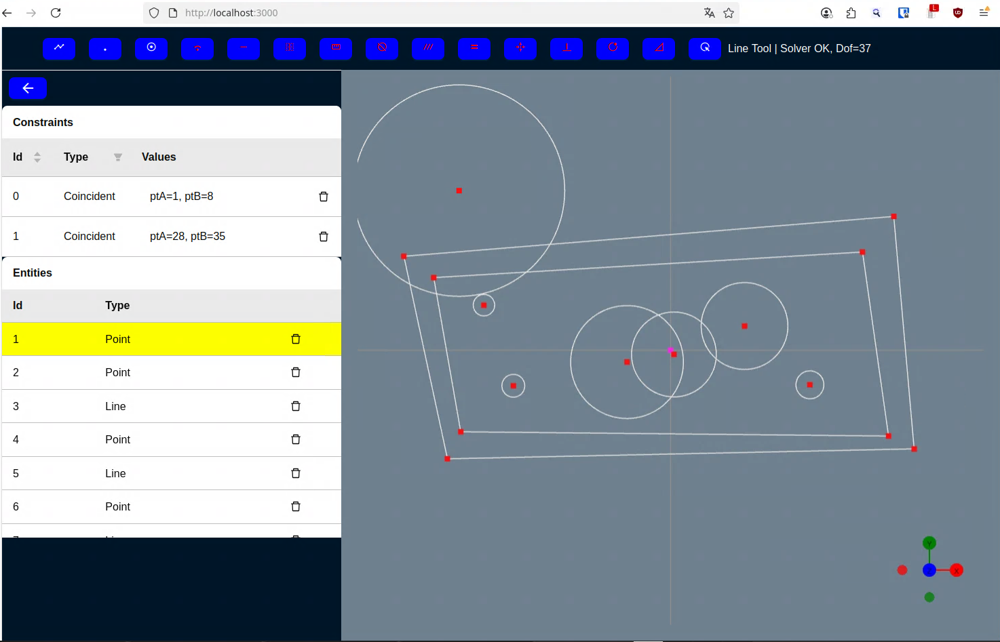
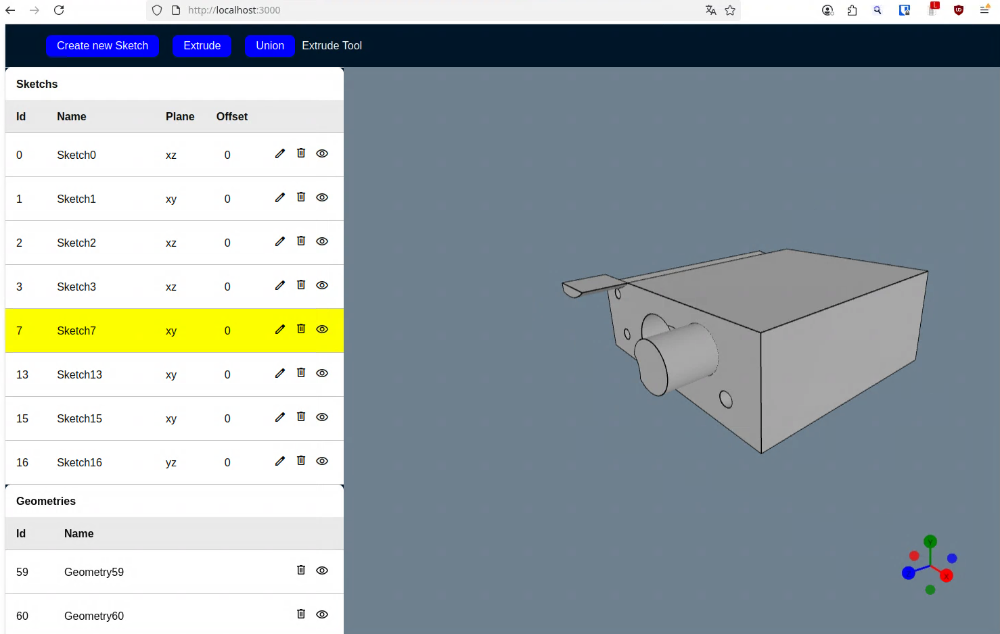

# R3F CAD

Goal of this project was to get a parametric 3D modelling experience similar as in other tools like FreeCAD or Onshape.
This tool, just consisting of a regular [Next.js](https://nextjs.org/) web app, features a Sketcher Tool as well as a 3D Modelling Tool.

In the Sketcher Tool you can draw sketches using constraints.
For constraint solving [solvespace](https://github.com/solvespace/solvespace) is used, namely a custom built [REST backend](https://github.com/sg-dev1/solvespace_rest) using a [python extension](https://github.com/sg-dev1/solvespace_python).
Each time constraint solving needs to be done a request is sent to this backend.

Having the final sketch all areas in this sketch are detected.
In the 3D Modelling Tool you can now extrude the individual shapes to create 3D models.
After extruding multiple 2D surfaces to 3D shapes you can use the Union Tool to merge it into a single shape.
A next step could then be (what is not implemented) to export the 3D shape so it can f.e. be 3D printed.

This project is considered as a proof of concept, using Open Source web technolgy to build a parametric 3D modelling experience similar to tools like FreeCAD or Onshape.
Since it is built using web technology it can be seen as kind of Open Source Onshape.
However, the features are very limited and to implement the features so it can be used for everyday work, it would require much more effort.

But maybe someone finds this project useful and wants to extend on it.
Then feel free to do so :)





## Getting Started

This is a [Next.js](https://nextjs.org/) project bootstrapped with [`create-next-app`](https://github.com/vercel/next.js/tree/canary/packages/create-next-app).

First, run the development server:

```bash
npm run dev
```

(You could also use other tools like `yarn` or `pnpm` if you like, however for development I used `npm`)

Open [http://localhost:3000](http://localhost:3000) with your browser to see the result.

## Dependencies

Here are some dependencies other than Next.js and React I used in this project.

- [React Three Fiber (R3F)](https://r3f.docs.pmnd.rs/getting-started/introduction)
- [R3F drei](https://www.npmjs.com/package/@react-three/drei)
- [@bitbybit-dev/occt-worker](https://www.npmjs.com/package/@bitbybit-dev/occt-worker)
- [antd](https://ant.design/)

## Visual Studio Code Extensions

The following Visual Studio Code extensions I used during development:

- Auto Rename Tag
- Highlight Matching Tag
- Prettier - Code formatter
  (Search on the Settings (File/Preferences/Settings) screen for this items and check/select them)
  - format on save
  - format on paste
  - Default Formatter (Prettier - Code formatter)
  - prettier.singleQuote to true // use sinqle quotes for strings
  - prettier.semi to true // add semi colon at end of each line
  - Wrap Line Length to 120 // maximum amount of characters per line (it is in Extensions/HTML)
    // default was 80 which is a bit few
  - Prettier: Print Width set to 120
    // default was also 80 causing similar behaviour like Wrap Line Length
- styled-colors: Very handy to visualize CSS colors in JavaScript and TypeScript files

Other Extensions:

- Emmet (by default in vs code)
  - emmet.includeLanguages --> "javacript": "javascriptreact"
- ES7 Snippets --> Install Extension ES7 +React/Redux/React-Native snippets
  - rafce (arrow func with export)
  - rfce (regular func with export)
  - same as the file name
  - react auto import
    - uncheck the following
  - React Snippets > Settings: Import React On Top
    (then the import React from 'react' is not added to the top)
